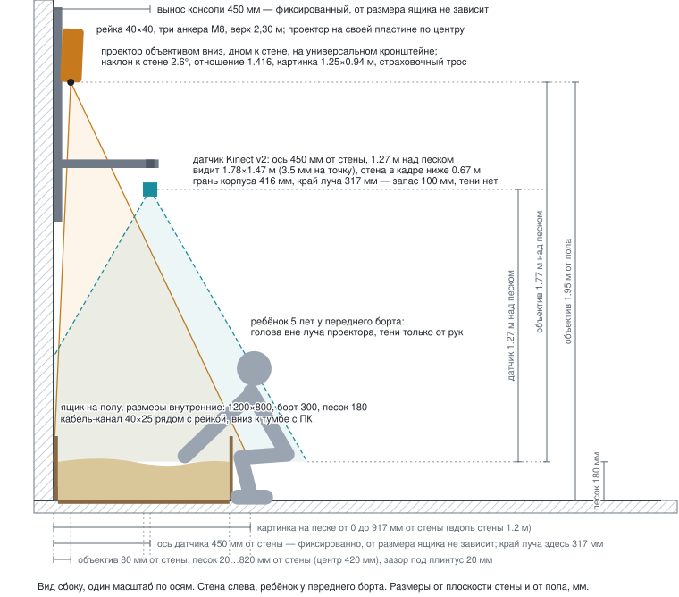
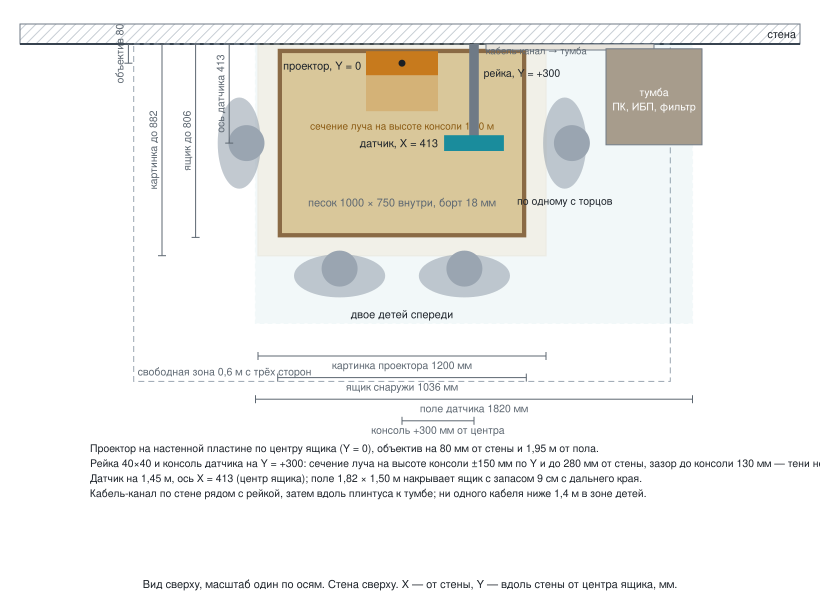

# Размещение у стены: расстояния и размер песочницы

Вид сбоку в масштабе: `img/wall-placement.svg`. Все размеры от плоскости стены
(ось X, перпендикулярно стене) и от пола (ось Z). Вдоль стены — ось Y, ноль в
центре ящика.





Интерактивная 3D-проверка удобства для ребёнка (возраст, поза, сторона,
карта досягаемости, луч, тени): файл `wall-layout-3d.html` — открыть в
браузере локально.

## 1. Исходные данные

| Параметр | Принято | Уточнить |
|---|---|---|
| Ящик, внутренний размер | 1000 × 750 мм, длинная сторона вдоль стены | вариант 1000 × 600, см. раздел 7 |
| Фанера | 18 мм | |
| Борт | 250 мм над дном; верх борта 268 мм от пола | |
| Песок | 130 мм слоя, поверхность **150 мм от пола** | |
| Зазор ящик–стена | 20 мм (под плинтус) | толщина плинтуса |
| Датчик | Kinect v2, поле 70° × 60°, 512 × 424 | v1 — раздел 4 |
| Проектор | 4:3 XGA, проекционное отношение 1,5, смещение объектива 100 %, разрешена установка объективом вниз | модель, отношение, смещение, допуск на вертикальную установку |
| Потолок | не ниже 2,35 м | высота |
| Стена | бетон или кирпич | материал (гипсокартон — отдельное решение) |

## 2. Ящик

| Величина | Формула | Значение |
|---|---|---|
| Наружная глубина (от стены) | 750 + 2 × 18 | **786 мм** |
| Наружная длина (вдоль стены) | 1000 + 2 × 18 | **1036 мм** |
| Ближняя наружная стенка | зазор | 20 мм от стены |
| Дальняя наружная стенка | 20 + 786 | **806 мм от стены** |
| Центр ящика | 20 + 786 / 2 | **X = 413 мм** |
| Внутренняя зона песка | 38 … 788 мм от стены | |

Плинтус: если он толще 20 мм, зазор = толщине плинтуса, и все X ниже растут
на ту же величину. Либо в задней стенке ящика снизу выбирается паз под плинтус,
тогда зазор 0 и центр X = 393 мм.

## 3. Датчик глубины (Kinect v2)

| Величина | Формула | Значение |
|---|---|---|
| Высота над песком | рабочий коридор 1,0–1,5 м, берём | **1,30 м** |
| Высота от пола | 0,15 + 1,30 | **1,45 м** |
| Положение по X | над центром ящика | **413 мм от стены** |
| Положение по Y (вдоль стены) | сдвиг от центра ящика, чтобы консоль датчика не попала в луч проектора | **+300 мм** |
| Запас поля зрения при сдвиге | 0,91 − 0,30 против полуящика 0,518 | 9 см с дальнего края, 39 см с ближнего |
| Зона вдоль стены | 2 × 1,30 × tg 35° | 1,82 м (ящик 1,04 — запас 39 см с каждой стороны) |
| Зона от стены | 2 × 1,30 × tg 30° | 1,50 м |
| Пиксель на песке | 1,82 / 512 | 3,6 мм |
| Стена в кадре | ниже Z = 1,45 − 0,413 / tg 30° | ниже 0,73 м от пола, обрезается маской ящика |

Датчик корпусом 249 × 66 × 67 мм ставится длинной стороной вдоль стены,
центр камеры глубины над X = 413. Стена в кадре — норма, но она должна быть
матовой: глянец даёт инфракрасные блики.

Вынос консоли от стены до оси датчика — 413 мм.

Почему консоль сдвинута вдоль стены. На высоте консоли (1,50 м) луч проектора
занимает ±150 мм по Y от центра и доходит до 280 мм от стены. Консоль на Y = 0
прошла бы прямо сквозь луч и дала бы на песке тёмную полосу шириной ≈ 160 мм
через весь ящик. При Y = +300 мм ближний край консоли на 280 мм от центра —
зазор до луча 130 мм, тени нет. Сам датчик и на Y = 0 был бы вне луча (его
ближний край на 380 мм от стены), мешает именно консоль.

## 4. Датчик, вариант Kinect v1

| Величина | Значение |
|---|---|
| Высота над песком | 1,20 м (v1 шумит выше 1,5 м) |
| Высота от пола | 1,35 м |
| Зона вдоль стены / от стены | 1,30 × 0,95 м (запас 13 / 8 см) |
| Пиксель | 2,0 мм |
| Стена в кадре | ниже 0,30 м — только зона плинтуса |

## 5. Проектор

Обозначения: T — проекционное отношение, W — ширина картинки, H = 0,75 W для
4:3, D — расстояние от объектива до песка по вертикали, o — смещение
объектива (1,0 = 100 %: нижний край картинки на уровне оси объектива).

Формулы:

```
D = T × W
угол ближнего края от оси:  a1 = atan((o − 1) × H / D)
угол дальнего края от оси:  a2 = atan(o × H / D)
наклон к стене, чтобы ближний край лёг в основание стены:
    θ = atan(x_объектива / D) + a1
дальний край на песке:  X_дальн = x_объектива + D × tg(a2 − θ)
```

Принято: T = 1,5, W = 1,2 м (ящик 1,036 плюс 8 см запаса с каждой стороны
вдоль стены), H = 0,9 м, o = 1,0.

| Величина | Значение |
|---|---|
| D над песком | 1,5 × 1,2 = **1,80 м** |
| Объектив от пола | 0,15 + 1,80 = **1,95 м** |
| Объектив по X | **80 мм от стены** (корпус толщиной 100 мм, зазор до стены 30 мм) |
| Ориентация | объективом вниз, дном к стене, «верх» корпуса от стены |
| Наклон к стене | atan(0,08 / 1,8) = **2,5°** |
| Картинка на песке от стены | **0 … 882 мм** (ящик 20 … 806 — накрыт, запас 7,6 см на дальнем краю) |
| Картинка вдоль стены | 1,2 м, центр над Y = 0 |
| Пиксель на песке | 1,2 / 1024 = 1,2 мм |
| Освещённость при 3000 лм | 3000 / (1,2 × 0,9) ≈ 2800 лк |
| Луч на высоте датчика (1,45 м) | доходит до X = 303 мм; датчик начинается с 380 мм — **вне луча, тени нет** |
| Разнос датчик–проектор по X | 413 − 80 = 333 мм (норма 250–350) |
| Консоль датчика | вне луча: сдвинута на 300 мм вдоль стены, зазор до луча 130 мм |
| Верх корпуса проектора | 1,95 + 0,25 + кронштейн 0,08 ≈ 2,28 м → потолок не ниже 2,35 м |

Смещение объектива у реального проектора — из паспорта. Что меняется:

| Смещение o | Наклон θ | Дальний край | Примечание |
|---|---|---|---|
| 0,9 (90 %) | 0° | 890 мм | без наклона, объектив на 80 мм |
| 1,0 (100 %) | 2,5° | 882 мм | расчётный вариант |
| 1,1 (110 %) | 5,4° | 859 мм | запас на дальнем краю 5 см |
| 0,5 (объектив по центру, короткофокусные и часть лазерных) | 0° | 863 мм | объектив ставится над центром ящика X = 413, вынос консоли 413 мм; датчик сдвигается вдоль стены на 300 мм — зона 1,82 м это позволяет |

Низкий потолок:

| Потолок | Решение |
|---|---|
| ≥ 2,35 м | расчётный вариант |
| 2,2–2,35 м | объектив на 1,85 м, W = 1,13 м: наклон 2,7°, дальний край 832 мм, запас 2,6 см — впритык, лучше отношение 1,4 |
| < 2,2 м | проектор с отношением ≤ 1,3 и объективом на 1,70 м, либо проектор горизонтально на стене и зеркало 45° |

Если паспорт проектора запрещает установку объективом вниз (часть ламповых) —
лазерный или LED с допуском «360°», либо зеркало.

## 6. Формат крепления: рейка на стене и две консоли

Один узел, три анкера. Ничего не сверлим в потолок и не ставим на пол.

```
   вид сбоку                          вид спереди (от ребёнка к стене)
                                      Y = 0, центр ящика     Y = +300 мм
   2,30 ─┬  верх рейки                    ▐▌ проектор           ┬ верх рейки
   2,25 ─●  анкер 3                       ▐▌ на пластине        ● 2,25
   1,85 ─●  анкер 2                       ▐▌ объективом вниз    ● 1,85
   1,52 ─┼──────────┐ консоль 450                               ┼──── консоль
         │          ▀ датчик                                    ▀ датчик
   1,45 ─●  анкер 1              луч на высоте консоли: ±150 мм ● 1,45
   1,40 ─┴  низ рейки            по Y — консоль в него не попадает ┴ 1,40
```

| Элемент | Что именно | Размеры и крепёж |
|---|---|---|
| Рейка | стальной профиль 40 × 40 × 2 мм, порошковая окраска, с приваренными ушками под анкеры | длина 900 мм, низ на 1,40 м, верх на 2,30 м, ось рейки на **Y = +300 мм** от центра ящика вдоль стены; три точки на 1,45 / 1,85 / 2,25 м |
| Анкеры в бетон | клиновой анкер M8 × 80 | момент затяжки по паспорту анкера, сверло 8 мм, глубина 70 мм |
| Анкеры в полнотелый кирпич | химический анкер M8 (ампула + шпилька) или дюбель 10 × 80 с шурупом 8 мм | пустотелый кирпич — только химический анкер с сеткой |
| Гипсокартон | рейка в металлические стойки каркаса (шаг 400/600 мм) саморезами по металлу 4,8 × 38, не менее 6 штук, либо сквозные шпильки M8 с пластиной 100 × 100 с обратной стороны | дюбели-«бабочки» и пластиковые — нельзя |
| Нижняя консоль (датчик) | профиль 40 × 40 × 2, длина 450 мм, приварен к рейке или на двух уголках 40 × 40 с болтами M8 | верх консоли 1,52 м; ось датчика на 413 мм от стены (338 мм для ящика 600) |
| Площадка датчика | пластина 100 × 80 × 3 мм на конце консоли; на ней шаровая головка на 3 кг с винтом ¼″-20 | Orbbec Femto Bolt и RealSense имеют резьбу ¼″; для Kinect v2 — печатный или готовый хомут-люлька на ту же головку. Шаровая головка нужна, чтобы выставить ось датчика вертикально по проверке плоскости в софте |
| Кронштейн проектора | универсальный кронштейн проектора (четыре раздвижные лапы под резьбы днища, наклон ±15°, поворот, нагрузка 10–15 кг); его пластина крепится прямо к стене по центру ящика (Y = 0) на четыре анкера M8, рейка проектор не несёт | так как проектор висит объективом вниз, его днище смотрит в стену — кронштейн работает как настенный с коротким выносом. Объектив оказывается на 80–180 мм от стены в зависимости от длины штанги кронштейна |
| Наклон проектора | 2,5° при объективе на 80 мм от стены; 5,7° при 180 мм | формула θ = atan(x_объектива / 1,8); дальний край картинки при 180 мм — 866 мм, ящик накрыт |
| Страховка | стальной тросик 2 мм с карабином от корпуса проектора к отдельному анкеру рядом с пластиной | обязательно над зоной детей |
| Регулировка | кронштейн: наклон к стене и поворот вокруг вертикали; шаровая головка: датчик в вертикаль; после калибровки все винты фиксируются, положение помечается маркером | повторная калибровка — только после любого касания винтов |
| Вес и момент | датчик 1,4 кг на плече 0,45 м = 6 Н·м; проектор 4 кг на плече 0,18 м = 7 Н·м | один анкер M8 в бетоне держит от 5 кН на вырыв; запас в сотни раз |

Готовые альтернативы, если не делать рейку: настенный кронштейн проектора
с выносом 100–200 мм (для проектора) плюс настенный кронштейн видеокамеры с
выносом 450 мм (для датчика), каждый на своих анкерах. Выходит дороже по
сверлению и хуже по жёсткости, но без сварки.

## 7. Размер песочницы: 750 или 600 мм в глубину

У стены ребёнок подходит с трёх сторон. Дальняя полоса песка у стены — 750 мм
от переднего борта. Ребёнок 5 лет уверенно достаёт на 500–550 мм. Полоса
150–250 мм у стены для маленьких детей недоступна: рельеф там просто стоит.

| | 1000 × 750 | 1000 × 600 |
|---|---|---|
| Наружная глубина | 786 мм | 636 мм |
| Центр ящика X | 413 мм | 338 мм |
| Вынос консоли датчика | 413 мм | 338 мм |
| Дальняя стенка | 806 мм | 656 мм |
| Картинка на песке (тот же проектор) | 0 … 882 мм | 0 … 882 мм, 22 см света на пол перед ящиком (софт гасит) |
| Песок | ≈ 100 л | ≈ 80 л |
| Кому подходит | подростки и взрослые достают до стены | дети 3–7 лет достают везде |

Для клиники с маленькими детьми рекомендуется **1000 × 600**. Остальные
расчёты меняются только в X: датчик и консоль на 338 мм.

## 8. Кабель-менеджмент

Правило: в зоне, куда достаёт ребёнок (ниже 1,4 м перед ящиком и сбоку), ни
одного открытого кабеля. Всё идёт по стене в закрытом кабель-канале.

### Трассы

```
 вид спереди (от ребёнка к стене)

   2,30 ─ кабель-канал 40×25 ▌ вверху: HDMI + питание проектора
          рейка               ▌ 1,95: выход HDMI из проектора, петля 0,3 м
                              ▌ 1,45: выход USB из датчика по консоли, петля 0,3 м
                              ▌
   0,10 ─ канал 25×16 вдоль плинтуса ══════▶ тумба с ПК, ИБП, фильтром
          ящик ■■■■■■■■■■■■          (сбоку от ящика, 300 мм от его торца)
```

| Кабель | Откуда — куда | Длина по трассе | Что взять |
|---|---|---|---|
| Датчик Kinect v2 | датчик (1,45 м) → по консоли → вниз по рейке → вдоль плинтуса → тумба | 0,45 + 1,35 + 0,9 ≈ 2,7 м | штатный кабель датчика 2,9 м до адаптера; адаптер и его блок 12 В — в тумбе; от адаптера USB 3.0 до ПК 1 м |
| Датчик Orbbec Femto Bolt | то же | 2,7 м | USB 3.0 Type-C ↔ A, 3 м, экранированный; питание 12 В отдельно, блок в тумбе |
| HDMI | проектор (1,95 м) → рейка → плинтус → тумба | 1,85 + 0,9 ≈ 2,8 м | HDMI 2.0 сертифицированный 3 м; угловой адаптер 90°, если разъём проектора смотрит в стену |
| Питание проектора | вариант А: розетка на стене на 2,10 м рядом с проектором, отдельная линия; вариант Б: шнур проектора вниз в канале до сетевого фильтра в тумбе | А: 0,3 м; Б: 2,8 м | А проще и чище; включение проектора тогда через PJLink по сети, а не выключателем фильтра |
| Сеть проектора (PJLink) | проектор → тумба (роутер/ПК) | 2,8 м | патч-корд кат. 5e 3 м, в том же канале |
| Питание ПК, ИБП, адаптер датчика | внутри тумбы | — | один сетевой фильтр с выключателем на 5 гнёзд |

### Кабель-канал

- По рейке: канал 40 × 25 мм с крышкой, от 2,30 м до пола, крепится к стене
  рядом с рейкой (Y ≈ +370 мм) (не к самой рейке, чтобы не мешать регулировке). Внутри:
  HDMI, патч-корд, кабель датчика, при варианте Б — шнур проектора.
- Вдоль плинтуса до тумбы: канал 25 × 16 мм, поверх плинтуса или вместо
  него на этом участке. Внутренние углы — штатные уголки, не изгибы кабеля.
- Радиус изгиба: HDMI не меньше 50 мм, USB 3.0 не меньше 40 мм. В углах
  канала кабель идёт дугой, не заломом.
- Заполнение канала не больше 60 %, чтобы крышка закрывалась без усилия.
- Канал крепится к стене дюбелями через 400 мм; крышка защёлкивается — ребёнок
  не откроет.

### Точки разгрузки

- У датчика: кабель закреплён хомутом на консоли в 100 мм от разъёма —
  разъём Kinect хрупкий, вес кабеля на нём висеть не должен.
- У проектора: сервисная петля 300 мм в верхней части канала, хомут на
  кронштейне; HDMI с винтовой фиксацией, если у проектора есть.
- В тумбе: все кабели помечены с двух концов (датчик, HDMI, сеть, 220 В),
  сервисные петли по 300 мм, чтобы вынуть ПК на обслуживание не расстыковывая.

### Компьютер и тумба

- Тумба или закрытая полка у стены сбоку от ящика, торец в 300 мм от ящика,
  чтобы ребёнок обходил ящик, не задевая. Дверца на замок.
- Вентиляция: решётки снизу и сверху, ПК не в закрытом ящике без притока.
- Внутри: ПК, ИБП, адаптер датчика с блоком питания, сетевой фильтр с
  выключателем, роутер или точка доступа для планшета.
- Одна кнопка для персонала — выключатель сетевого фильтра; проектор
  включается софтом по PJLink, датчик получает питание от адаптера в той же
  цепи.

### Что нельзя

- Тянуть USB 3.0 датчика через пассивный удлинитель или хаб.
- Класть 220 В и сигнальные кабели в один канал без перегородки на участках
  длиннее 3 м; здесь трассы короткие, допустимо, но лучше двухсекционный
  канал.
- Оставлять кабель между рейкой и стеной: он должен быть в канале, а не в
  зазоре.

## 9. Почему у стены удобно

- Проектор у стены, дети у переднего борта: голова ребёнка вне луча, тени
  только от рук.
- За ящиком никто не ходит, всё железо над зоной, куда не ступают.
- Не нужен ни потолок, ни напольная стойка: три анкера в стену.

## 10. Что измерить перед монтажом

1. Высота потолка в точке над ящиком.
2. Материал стены (простукать: бетон, кирпич, гипсокартон).
3. Толщина и высота плинтуса.
4. Модель проектора: проекционное отношение, смещение объектива, допуск на
   установку объективом вниз, размеры корпуса.
5. Датчик: v1 или v2.
6. Свободная длина вдоль стены: нужно 1036 мм ящика плюс по 300 мм с каждой
   стороны для доступа ребёнка, итого ≈ 1,7 м.
7. Решение по глубине ящика: 750 или 600 мм.
